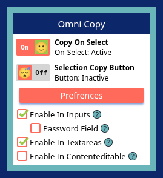

	
	 
	The <b>Ultimate Text Selection Tool</b> — your clipboard, your rules.
	 
	<a href="https://addons.mozilla.org/en-US/firefox/addon/omni-copy/">Firefox Add-on</a>

## Overview

Omni Copy is a Firefox and Chrome extension that makes copying text effortless.  
Just select what you need and it's instantly copied, or use a floating button if you prefer.  
You control where it works — keep it out of password fields and text editors so you don't accidentally copy while typing.  
Want to keep everything you copy? Turn on Collect to File and build up a single document as you go.  
Simple, configurable, and respectful of your workflow.

## Features

- **Auto-Copy on Select** — Select some text, and it's already on your clipboard.

- **Floating Copy Button** — Prefer a manual step? A small button pops up after you select, so you copy on your terms.

- **Collect to File** — Turn on collecting, and every copy gets added to a built-in editor. Edit it, load an existing file to keep adding to, and save it all as one file whenever you're ready.

- **Granular Control** — Turn copying on or off for inputs, password fields, textareas, and rich text editors — down to each one.

- **Lightweight** — No bloat, no tracking. Just copying.

## Installation

### Firefox:

Get the latest available version from the [Mozilla Add-ons](https://addons.mozilla.org/en-US/firefox/addon/omni-copy/).

### Chrome & Chromium based:

Not on the Chrome Web Store — install it from source instead (steps below).

### Install from source:

1. Create `.output` directory with `npm run build` or `npm run build:firefox`
2. Now in `.output` directory you should see `firefox-mv2` or `chrome-mv3`
3. Make sure the extension is not already installed

**For firefox**

4. Open `about:debugging` in a new tab
5. Click on `This Firefox` and click `Load Temporary Add-on...`
6. Select `manifest.json` file produced earlier in `firefox-mv2` folder (or any other file)

**For chrome**

4. Open `Extensions` or `chrome://extensions/` in a new tab
5. Turn on `Developer mode` and click `Load unpacked`
6. Select `chrome-mv3` folder produced earlier in `.output`

> note: You should activate "Show hidden folders" in the browser file picker dialog to access `.output` folder

## Settings

Omni Copy lets you customize exactly how and where copying works.

### Copy Mode

Choose how you want to copy text:

- **Copy On Select** — Text is copied the moment you finish selecting it. Fast and effortless.

- **Selection Copy Button** — A floating button appears after you select. Click it to copy. Good if you want to double-check before copying.

### Collect to File

Turn this on and every copy also gets added to a built-in text editor instead of just your clipboard.

- **Open the editor** — Review everything collected so far, edit it directly, or clear it and start over.

- **Load an existing file** — Pick a file to bring in, and new copies get added on top of it.

- **Export** — Save everything as a single file whenever you're ready, named however you like.

### Where Copying is Allowed

By default, copy on select is enabled on regular webpage text. Enable or disable copying in specific fields based on your needs.

- **Enable in inputs** — Text input fields. You can optionally allow password fields too, but be careful with sensitive data.

- **Enable in Textareas** — Multi-line text areas. Useful for copying from comment boxes or text editors.

- **Enable in Contenteditable** — Editable content regions, like Medium or Google Docs. Let you copy while writing without accidentally losing your draft.

## Donation

Made with ❤️ — if you found this helpful, a small <a href="https://tinycod3r.blogspot.com/2026/05/fuel-my-passion.html" target="_blank" rel="noopener noreferrer">donation</a> would mean a lot.

## License

This project is licensed under the MIT License — see the [License](LICENSE) file for details.

## Contributing

Contributions are welcome! Found a bug? Have an idea? Want to improve something? here's how to help:

- **⭐ this repo** — It helps others discover omni-copy

- **Report bugs && suggest features** — Just go to [this page](https://github.com/echo-64/omni-copy/issues) and click the "New issue" button.

- **Code Contributions** — Fork the repo, make your changes, and send a pull request. We'll review it together.

- **Leave feedback** — Reviews on the Chrome Web Store and Firefox Add-ons mean a lot
